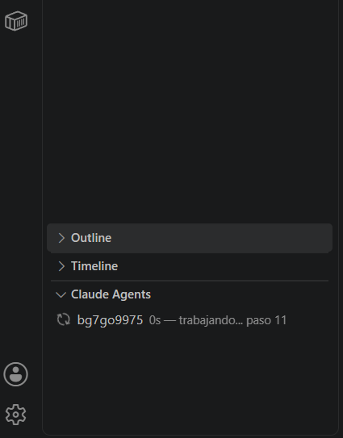

# Claude Agent Monitor

Muestra los agentes y tareas en segundo plano de [Claude Code](https://claude.com/product/claude-code): **cuántos hay, hace cuánto y qué están haciendo**. Sin dependencias y **sin consumir tokens**.



Sirve sobre todo para lo que no se ve: un agente **colgado** deja de escribir igual que uno que terminó. El monitor los marca 🔴 con el tiempo que llevan mudos.

## Dos formas de instalarlo, según dónde uses Claude

| Dónde trabajás | Qué instalás | Qué ves |
|---|---|---|
| Terminal / app de escritorio | **plugin de Claude Code** | una línea en pantalla en cada acción |
| VS Code | **extensión** | panel lateral que se refresca solo |

Los dos leen lo mismo y se pueden tener juntos.

### Plugin de Claude Code

```
/plugin marketplace add Reikor-Arg/claude-agent-monitor
/plugin install agent-monitor
```

Listo. En cada acción aparece:

```
⚡ 2/3 activos · a3f2 4m Grep · b8c1 🔴 12m sin output
```

Y cuando lo quieras a pedido:

```
/agentes
```

### Extensión de VS Code

```
npx @vscode/vsce package
code --install-extension agent-monitor-0.1.2.vsix
```

Recargá la ventana (`Ctrl+Shift+P` → "Reload Window"). El panel **Claude Agents** aparece en el Explorador.

Sin empaquetar, copiando la carpeta:

- Windows: `%USERPROFILE%\.vscode\extensions\teraserver.agent-monitor-0.1.2\`
- macOS/Linux: `~/.vscode/extensions/teraserver.agent-monitor-0.1.2/`

## Cómo lee el estado

Claude Code deja la salida de cada tarea en `<temp>/claude/<proyecto>/<sesión>/tasks/*.output`. El monitor mira esos archivos:

- escribió hace menos de 30 s → 🟢 trabajando
- dejó de escribir y **no** cerró → 🔴 con el tiempo mudo
- cerró con `[exited with code N]` → terminó, no se muestra

Ese marcador al final del archivo es lo que separa "terminó" de "colgado": sin él los dos se ven igual, porque los dos dejan de escribir.

## Por qué no cuesta tokens

El plugin reporta por el campo `systemMessage` de un hook `PostToolUse`: eso se muestra **al usuario** y no entra al contexto del modelo. La extensión de VS Code corre entera dentro del editor. Ninguno de los dos manda nada al modelo.

En la app de escritorio y en VS Code no se puede usar la *statusline* de Claude Code — está probado, esas superficies no la ejecutan. De ahí que sean dos piezas y no una.

## Alcance

Proyecto no oficial, **sin afiliación con Anthropic**. Lee un formato de archivos interno y no documentado; si cambia, el monitor puede dejar de mostrar datos hasta que se actualice.

## Licencia

MIT — ver [LICENSE](LICENSE).
